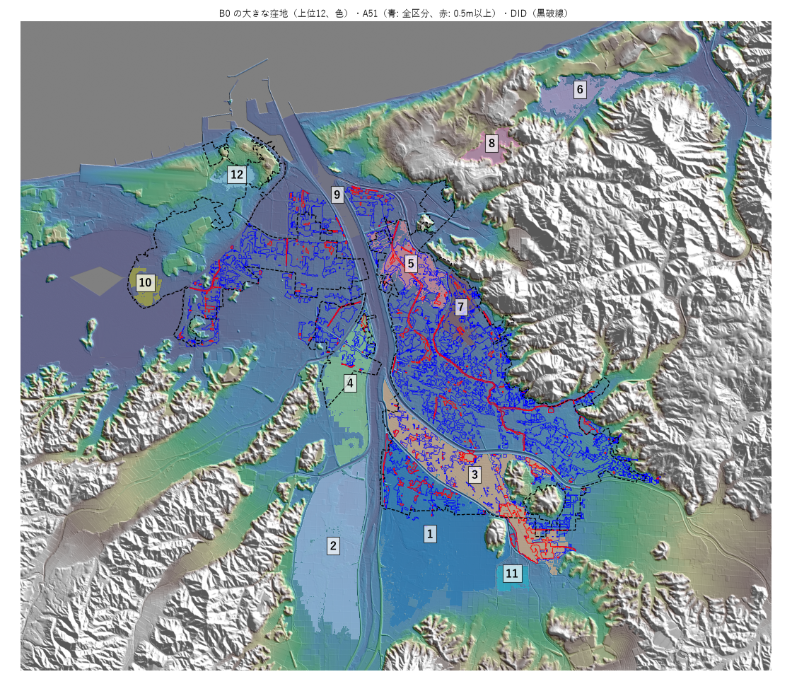
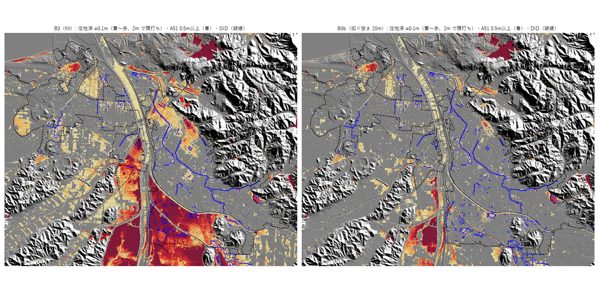

# 段階1の試行：鳥取市

作業日: 2026-10-03
関連: [検証対象地域の選定](study-area-selection.md) §5 / [手法選定](method-survey.md) §6.2・§7 / [標高データの候補](elevation-sources.md)

## 1. 鳥取市を選んだ理由

- 都市型水害の発生地（DID で絞った 200 市区町村）のうち、A51 がある8市の1つ（2010〜2023年の内水・窪地内水 160棟）。
- その8市で唯一、市街地を覆う高解像度の標高（鳥取県 DEM 0.5m）がある（[検証対象地域の選定](study-area-selection.md) §4.1）。

## 2. 範囲とデータ

| 項目 | 内容 |
|---|---|
| 正解 | A51（2025年度版）鳥取市。8.08 km²。7割が「0.3m未満」 |
| 評価する範囲 | 鳥取市の DID（令和2年、3地区）21.9 km²。A51 の 80%（6.47 km²）がこの中にある |
| 計算する範囲 | A51 と DID の外接矩形に 2km のバッファ（14.1km × 12.2km）。市町村の境界で DEM を切らない |
| 標高 | 鳥取県 DEM 0.5m（[G空間情報センター](https://www.geospatial.jp/ckan/dataset/dem05_tottori)）。計算範囲にかかる 65 タイルを、平均して 1m にした |
| 座標系 | 平面直角座標系 V系（EPSG:6673） |

- A51 の区域は約 5.7m × 4.6m のメッシュでできている（緯度経度で区切った 5m 格子。元のシミュレーションの格子と思われる）。
- 1m の格子で、A51 の形をそのまま格子にして比べた。

## 3. 手順

```
uv run python scripts/prepare_trial.py      # 1m 格子に DEM・A51・DID・市域をそろえる
uv run python scripts/baseline_b0.py        # B0 窪地深、B0b 掘り抜き＋窪地深
uv run python scripts/evaluate_baselines.py # A51 と比べる → output/tottori/baseline_metrics.csv
uv run python scripts/plot_trial.py         # 確認用の図 → output/tottori/*.png
```

- B0: WhiteboxTools の FillDepressions で窪地を埋め、「埋めた後 − 元の標高」を窪地深とした。雨量は使わない。
- B0b: 窪地の出口を最大 10〜100m まで最小コストで掘り抜き（WhiteboxTools BreachDepressionsLeastCost）、抜けきらない窪地だけを埋めて、その深さを窪地深とした。道路・堤防の下を通る水路や樋門が DEM に表れない分を補うため（§5）。掘り抜く距離は1つに決めず掃引した。
- 比べる基準として、ランダムと「標高だけ（低いほど危ない）」を並べた（[手法選定](method-survey.md) §7 の 5）。
- 計算時間は、準備 40秒、B0 45秒、B0b 5通りで 4分、評価 15秒。

## 4. 結果（2026-10-03）

正解を A51 の浸水深の区分で3通りに分けた。上位 k% は、評価範囲の面積のうち、スコアの高い順に k% を取ったもの。

| 正解（A51） | 評価範囲に占める割合 | 手法 | PR-AUC | 上位5%の lift | 上位10%の lift | 面積をそろえた CSI |
|---|---|---|---|---|---|---|
| 全区分 | 29.5% | ランダム | 0.295 | 1.0 | 1.0 | 0.173 |
| | | 標高だけ | 0.359 | 0.7 | 1.1 | 0.247 |
| | | B0 窪地深 | 0.358 | 1.6 | 1.2 | 0.236 |
| | | **B0b 掘り抜き 20m** | **0.361** | **1.9** | **1.9** | 0.238 |
| 0.3m以上 | 7.0% | ランダム | 0.070 | 1.0 | 1.0 | 0.036 |
| | | 標高だけ | 0.107 | 1.9 | 2.0 | 0.077 |
| | | B0 窪地深 | 0.183 | 3.5 | 2.3 | 0.114 |
| | | **B0b 掘り抜き 20m** | **0.225** | **5.4** | **4.2** | **0.205** |
| 0.5m以上 | 2.9% | ランダム | 0.029 | 1.0 | 1.0 | 0.015 |
| | | 標高だけ | 0.056 | 3.2 | 2.5 | 0.048 |
| | | B0 窪地深 | 0.135 | 5.3 | 3.3 | 0.114 |
| | | **B0b 掘り抜き 20m** | **0.191** | **8.1** | **5.3** | **0.158** |

B0b の掘り抜く距離ごとの結果（正解: A51 0.5m以上。全体は output/tottori/baseline_metrics.csv）:

| 掘り抜く最大距離 | PR-AUC | 上位5%の lift | 面積をそろえた CSI |
|---|---|---|---|
| なし（B0） | 0.135 | 5.3 | 0.114 |
| 10m | 0.130 | 4.6 | 0.101 |
| **20m** | **0.191** | **8.1** | **0.158** |
| 30m | 0.157 | 6.9 | 0.139 |
| 50m | 0.144 | 6.7 | 0.141 |
| 100m | 0.148 | 6.0 | 0.144 |

B0 の窪地深 ≥ 0.1m を「推定域」とした二値の結果（面積の下限 0 / 100 / 1,000 m² でほぼ同じ）:

| 正解（A51） | 推定域の面積 | precision | recall | CSI |
|---|---|---|---|---|
| 全区分 | 7.0〜7.3 km² | 0.40 | 0.43〜0.45 | 0.26 |
| 0.3m以上 | 同上 | 0.15 | 0.71〜0.73 | 0.14 |
| 0.5m以上 | 同上 | 0.07 | 0.77〜0.80 | 0.07 |

## 5. 分かったこと

- **深い所は窪地で説明できる。**
  - A51 の 0.5m 以上の区域は、B0 の上位5% の面積に 27% が入る（lift 5.3）。標高だけ（lift 3.2）より明らかに良い。
  - A51 の 0.3m 以上の区分では、68〜84% のセルが窪地深 0.1m 以上になっている。
- **浅い区域（0.3m未満）は窪地では説明しにくい。**
  - A51 の7割を占め、DID の 23% に薄く広がっている。全区分を正解にすると、B0 もほとんど上積みがない（PR-AUC 0.358 対 ランダム 0.295）。
  - 浅い区域は、窪地に溜まる水ではなく、道路や宅地を流れる水や、排水が追いつかない分を表していると考えられる。雨量を入れる段階2（fill-spill）で確かめる。
- **大きな窪地の誤検出が多い。**
  - 窪地深 0.1m 以上の推定域は 7 km² で、A51 の 0.5m 以上（0.63 km²）の 11 倍ある。
  - 数 km² の大きな窪地が丸ごと埋まっている。最大のもの（4.7 km²、最大深さ 6.7m）は、A51 に当たるのが 8% だけ。窪地深 1〜2m の帯も、A51 に当たるのは 25% にとどまる。堤防・盛土に囲まれた低地や、DEM に表れない水路・暗渠で、実際には排水される所と思われる（[手法選定](method-survey.md) §8）。
  - 窪地の面積の下限（100 / 1,000 m²）は効かない。効くのは「大きすぎる窪地」の扱いである。



- 大きな窪地の上位12を地図で見ると（上の図）、次のように分かれる。
  - #1・#2（4.7・3.1 km²）: 千代川の両岸の南の水田。川の堤防に囲まれて丸ごと埋まった。
  - #3・#4: 千代川と袋川に挟まれた低地。#3 は A51 に 40% 当たる。
  - #5・#7: DID の東の市街地。A51 に 67〜72% 当たる（正しく拾えている）。
  - #6・#8: DID の外の鳥取砂丘の周り（多鯰ケ池、深さ 14m のすり鉢）。評価範囲の外。
- **掘り抜くと、堤防に囲まれた低地の誤検出が消える。**
  - B0b（20m）で、窪地深 0.1m 以上の面積は計算範囲の 18% から 7% に減った。
  - A51 0.5m 以上での上位5% の lift は 5.3 から 8.1、面積をそろえた CSI は 0.114 から 0.158 に上がった。
  - 20m は道路や堤防の幅に近い。それより短いと抜けきらず、長いと市街地の本物の窪地まで抜けてしまう。
  - ただし 20m は鳥取市1つで選んだ値である。他の市町村でも同じ距離が効くかを、段階2の交差検証で確かめる。



- **A51 の深い区域の多くは、線の形をしている。**
  - 上の図の青い線（A51 0.5m 以上）は、旧袋川や排水路などの水路に沿って並ぶ。
  - 水路は下流に抜けるので、窪地としては埋まらず、B0・B0b のどちらでも拾えない。
  - 評価設計（[手法選定](method-survey.md) §7 の 1）は「河道と水面は除く」としているが、まだ水面のマスクを作っていない。水路を除くと評価が変わる可能性がある。

## 6. 次の作業

1. 水面・水路のマスクを作り（基盤地図情報の水涯線、OSM の waterway など）、評価から除いた場合と、A51 の線状の区域が水路そのものかを確かめる。
2. B2（TWI・HAND）と B3（地形分類の内水関連区分）を同じ評価に加える。
3. B4（上尾市型）のため、鳥取市の内水の浸水実績の点・区域があるか確かめる。
4. 段階2の fill-spill で、有効降雨を掃引したときの浅い区域の再現を見る。
